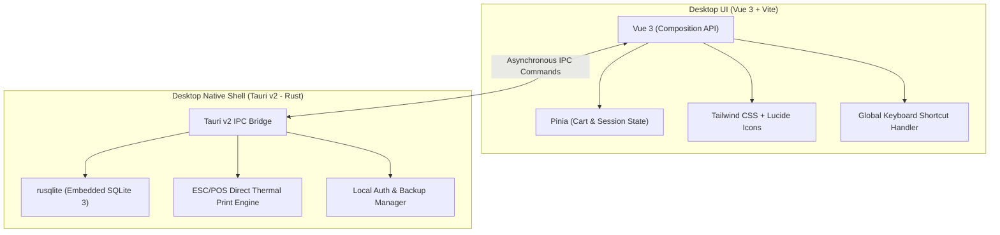
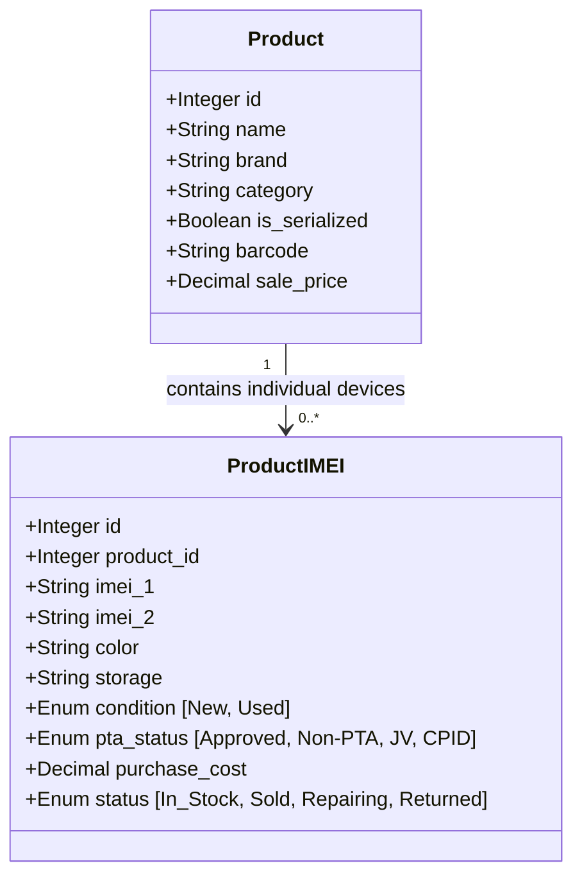
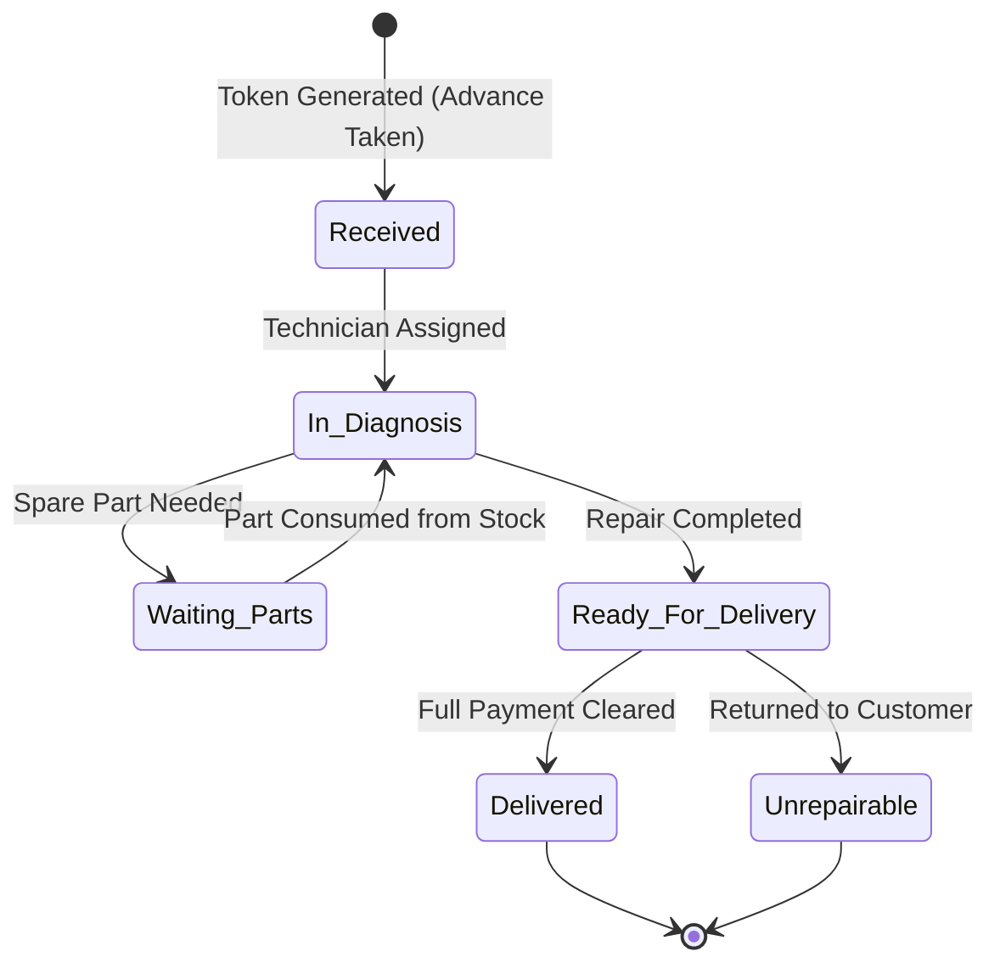

# Mobile Shop POS & Inventory — Offline Desktop Specification

**Project Overview:**  
Ek mukammal, fast, aur offline-first desktop application jo khas tor par **Mobile Phone Shops, Accessories Retailers, aur Repairing Labs** ke liye design ki gayi hai. Isme kisi kisam ki multi-tenancy ya internet ki zaroorat nahi hai. Ye shop ke computer par 100% locally aur lifetime baghair kisi monthly subscription ke chalegi.

---

## 1. Technology Stack (Offline Desktop Architecture)



| Layer | Technology | Rationale / Benefits |
| :--- | :--- | :--- |
| **Desktop Shell** | **Tauri v2** | Rust-based modern desktop framework. App size sirf ~15MB hota hai aur RAM consumption Electron (300MB+) ke muqablay mein sirf 25-40MB hoti hai. |
| **Backend Engine** | **Rust (2021 Edition)** | Ultra-fast performance, memory-safe, crash-resistant, aur direct hardware access (Thermal Printers, Barcode Scanners). |
| **Local Database** | **SQLite 3 (`rusqlite`)** | Single-file local database. Zero-configuration. `PRAGMA journal_mode=WAL` aur `foreign_keys=ON` ke sath ultra-reliable aur atomic transactions. |
| **Frontend UI** | **Vue 3 + Vite** | Tez tareen rendering, instant page load, aur clean component architecture. |
| **State Management** | **Pinia** | POS cart state, active register session, aur real-time total calculations. |
| **Styling & Design** | **Tailwind CSS** | Clean, high-contrast, modern UI jo touch screens aur desktop monitors dono par asani se chalay. |
| **Receipt Printing** | **Direct ESC/POS (USB / Network)** | Browser print dialog ke baghair direct 1-click thermal receipt printing (80mm aur 58mm). |
| **Decimal Precision** | `rust_decimal` | Money aur profit calculations mein 0% rounding error (No floating point issues). |

---

## 2. Core Modules & Feature Specifications

---

### Module 1: Dual Inventory & Catalog Engine (IMEI vs Accessories)

Mobile shop mein do tarah ki inventory hoti hai:
1. **Serialized Items (Phones/Tablets):** Har piece ka unique IMEI hota hai.
2. **Standard Items (Accessories/Parts):** Bulk quantity aur standard barcode hoti hai.



#### A. Mobile Handsets (IMEI-Tracked Inventory):
* **Unique Identification:** Har mobile unit ke do IMEI numbers (`imei_1`, `imei_2`) aur serial number store hotay hain.
* **PTA Status:**
  * PTA Approved
  * Non-PTA
  * JV / Network Locked
  * CPID Approved
  * Software Approved
* **Condition & Grading:**
  * **Brand New (Pin Pack / Box Pack):** Official company warranty ke sath.
  * **Used (Kit / Second Hand):** 9/10, 10/10 condition grading aur shop checking warranty days (e.g. 7 days / 15 days).
* **Storage & Color Matrix:** Model ke sath Storage (64GB, 128GB, 256GB, 512GB) aur Color (Black, Silver, Blue, etc.) maintain karna.
* **Exact Costing (COGS):** Har handset ki khareed qeemat alag hoti hai. System average cost nahi balkay us **specific IMEI ki actual purchase cost** ke hisab se net profit nikalta hai.

#### B. Accessories & Spare Parts (Standard Barcode Inventory):
* Chargers, Cables, Handsfree, Power Banks, Glass Protectors, Back Covers, LCD Displays, Batteries.
* Standard barcode scanning, stock alerts, wholesale vs retail sale price.

---

### Module 2: High-Speed POS Billing & Checkout

* **Fast Scanner-First Checkout:**
  * Cashier scanner se IMEI scan kare ya accessory ka barcode scan kare — item foran cart mein add ho jata hai.
  * IMEI scan karne par system foran check karta hai ke kya ye IMEI stock mein mojood hai aur sellable hai.
* **Multi-Tender Payments (Pakistani Market Specific):**
  * **Cash**
  * **JazzCash / EasyPaisa**
  * **Raast / Online Bank Transfer (Nayapay, Sadapay, HBL, Meezan, etc.)**
  * **Card Swipe (POS Terminal)**
  * **Udhaar (Customer Khata Debit)**
  * *Split Tender:* Maslan 50,000 Cash aur 30,000 JazzCash ek hi bill mein.
* **Warranty Slip / Thermal Invoice Printing:**
  * 80mm / 58mm thermal receipt.
  * Dukan ka naam, phone number, address aur logo.
  * **IMEI numbers bold print** hotay hain taake future warranty claim mein koi ambiguity na ho.
  * PTA status, warranty duration (e.g. "7 Days Checking Warranty"), aur return policy terms.
* **Keyboard Hotkeys:**
  * `F1`: New Sale / Clear Cart
  * `F2`: Focus Search / Scan IMEI
  * `F3`: Customer Select / Khata
  * `F4`: Add Discount
  * `Ctrl + Enter`: Complete Sale & Print Receipt

---

### Module 3: Mobile Repairing Lab & Service Ticketing

Mobile shop ka sab se profitable hissa repairing lab hota hai. Is module se repairing ka hisab transparent ho jata hai:



* **Repair Job Sheet / Claim Token:**
  * Customer details (Name, Phone).
  * Device model aur IMEI/Serial number.
  * Screen Lock / Password / Pattern lock ka record.
  * Physical condition checklist (Screen cracked, body dented, SIM tray missing, camera working, etc.).
  * Customer ki complaint (e.g. "Display flickering", "Not charging", "Water damaged").
* **Financial Details:**
  * Estimated cost (Andazan kharcha).
  * Advance payment received.
  * Balance remaining at delivery time.
* **Spare Parts Consumption:**
  * Agar technician ne shop ki inventory se LCD ya charging flex lagai hai, to wo direct is ticket par charge ho sakti hai aur stock kam ho jata hai.
* **Customer Claim Slip:**
  * Thermal print slip milti hai jisme barcode/QR code aur tracking number hota hai. Customer ye slip la kar phone collect karta hai.

---

### Module 4: Used Phone Purchase & Trade-In (Legal Protection)

Dukan par log purana phone bechnay aate hain ya naye ke sath exchange karte hain. Police aur legal issues se bachne ke liye ye module mandatory hai:

* **Seller Identification Record:**
  * Seller Name, Father Name, CNIC / National ID Number, Mobile Number, aur Address.
  * Customer ke CNIC ki front/back picture / scan upload karne ki sahulat.
* **Phone Verification:**
  * Brand, Model, Storage, Color, IMEI 1 & IMEI 2.
  * PTA Status, Physical condition, Box & Accessories mojood hain ya nahi.
* **Purchase Agreement Slip (Voucher):**
  * Auto-generated legal affidavit print hota hai:  
    *"Mein tasdeeq karta hoon ke ye phone meri malkiyat hai aur kisi gher-qanooni kaam mein mulawis nahi..."*
  * Seller ke dastakhat (Signature) aur anghoothay (Thumb impression) ki jagah.
* **Automatic Stock Inflow:**
  * Purchase finalize hone par ye IMEI foran `Used Inventory` mein add ho jata hai aur uski purchase cost register ho jati hai.
* **Exchange / Trade-In Flow:**
  * Agar customer ne purana phone de kar naya liya hai, to puranay phone ki value naye phone ke bill mein se minus ho jati hai.

---

### Module 5: Customer Khata & Installment (Kist) Ledger

* **Digital Khata:**
  * Har customer ka running udhaar aur wasooli ka hisab.
  * Receipt par previous balance aur net remaining balance automatically print hota hai.
* **Installment Management (Mobile on Installments):**
  * Total price, down payment, monthly installment, aur total duration (e.g. 6 Months).
  * Monthly installment due date reminders.
  * Installment receipt printing (Wasooli raseed).

---

### Module 6: Purchasing & Supplier (Vendor) Management

* **Bulk IMEI Inward:**
  * Distributor se 10 phones ka dabba aaya: Excel import ya fast scanning se 10 ke 10 IMEIs ek sath purchase order mein enter karna.
* **Supplier Payables (Accounts Payable):**
  * Wholesalers aur distributors ka khata (Bill amount, paid amount, baqaya balance).
* **Warranty Claims / Faulty Stock Returns:**
  * Jo phones ya accessories kharab niklein, unhe supplier ko wapis bhejne (Debit Note) ka record.

---

### Module 7: Cash Drawer & Shift Management

* **Register Open Float:** Shift shuru karte waqt drawer mein mojood cash enter karna.
* **Shift Close Reconciliation:**
  * Total Cash Sales
  * Total JazzCash / EasyPaisa Transfers
  * Total Bank Transfers
  * Total Khata / Udhaar Sales
  * Shop Daily Expenses (Chaye, khana, bijli ka bill, etc.)
  * Cash in hand vs system expected cash ka farq (Discrepancy / Shortage check).

---

### Module 8: Analytics & Profit Reports

* **True Device-Wise Profit:**
  * Ek ek phone ka exact purchase cost vs sale price ka net profit report.
* **Daily / Weekly / Monthly Sales & Revenue:**
  * Kitnay naye phones bikay, kitnay used phones bikay, kitni accessories aur kitna repair ka kaam hua.
* **Stock Valuation Report:**
  * Dukan ke andar is waqt kitnay lakh/crore ka maal para hua hai (Total investment in Handsets + Total in Accessories).
* **Slow-Moving Stock Alert:**
  * Kaun se models pichlay 30 din se dukan mein paray hain aur nahi bik rahay.

---

## 3. SQLite Database Schema Design (Key Tables)

```sql
-- 1. Master Products Table
CREATE TABLE products (
    id INTEGER PRIMARY KEY AUTOINCREMENT,
    name TEXT NOT NULL,
    brand TEXT NOT NULL,
    category TEXT NOT NULL,
    barcode TEXT UNIQUE,
    is_serialized INTEGER DEFAULT 0, -- 1 for Phones, 0 for Accessories
    sale_price DECIMAL(12,2) NOT NULL,
    alert_quantity INTEGER DEFAULT 5,
    created_at DATETIME DEFAULT CURRENT_TIMESTAMP
);

-- 2. Serialized Phones / IMEIs Table
CREATE TABLE product_imeis (
    id INTEGER PRIMARY KEY AUTOINCREMENT,
    product_id INTEGER NOT NULL REFERENCES products(id),
    imei_1 TEXT UNIQUE NOT NULL,
    imei_2 TEXT,
    color TEXT,
    storage TEXT,
    condition TEXT CHECK(condition IN ('new', 'used')),
    pta_status TEXT CHECK(pta_status IN ('approved', 'non_pta', 'jv', 'cpid', 'software')),
    purchase_cost DECIMAL(12,2) NOT NULL,
    warranty_days INTEGER DEFAULT 0,
    status TEXT DEFAULT 'in_stock' CHECK(status IN ('in_stock', 'sold', 'repairing', 'returned')),
    sold_at DATETIME,
    created_at DATETIME DEFAULT CURRENT_TIMESTAMP
);

-- 3. Sales Table
CREATE TABLE sales (
    id INTEGER PRIMARY KEY AUTOINCREMENT,
    invoice_no TEXT UNIQUE NOT NULL, -- e.g. INV-000101
    customer_id INTEGER REFERENCES customers(id),
    total_amount DECIMAL(12,2) NOT NULL,
    discount_amount DECIMAL(12,2) DEFAULT 0.00,
    net_amount DECIMAL(12,2) NOT NULL,
    paid_amount DECIMAL(12,2) NOT NULL,
    change_amount DECIMAL(12,2) DEFAULT 0.00,
    payment_method TEXT NOT NULL, -- cash, jazzcash, easypaisa, bank, split, udhaar
    payment_details TEXT, -- JSON for split tenders
    cashier_id INTEGER NOT NULL,
    created_at DATETIME DEFAULT CURRENT_TIMESTAMP
);

-- 4. Sale Items Table
CREATE TABLE sale_items (
    id INTEGER PRIMARY KEY AUTOINCREMENT,
    sale_id INTEGER NOT NULL REFERENCES sales(id) ON DELETE CASCADE,
    product_id INTEGER NOT NULL REFERENCES products(id),
    product_imei_id INTEGER REFERENCES product_imeis(id),
    quantity DECIMAL(10,2) NOT NULL,
    unit_cost DECIMAL(12,2) NOT NULL,
    unit_price DECIMAL(12,2) NOT NULL,
    line_total DECIMAL(12,2) NOT NULL
);

-- 5. Mobile Repair Tickets Table
CREATE TABLE repair_tickets (
    id INTEGER PRIMARY KEY AUTOINCREMENT,
    ticket_no TEXT UNIQUE NOT NULL, -- e.g. REP-00101
    customer_name TEXT NOT NULL,
    customer_phone TEXT NOT NULL,
    device_model TEXT NOT NULL,
    imei TEXT,
    pattern_or_pin TEXT,
    problem_description TEXT NOT NULL,
    condition_notes TEXT,
    estimated_cost DECIMAL(12,2) NOT NULL,
    advance_paid DECIMAL(12,2) DEFAULT 0.00,
    status TEXT DEFAULT 'received' CHECK(status IN ('received', 'in_diagnosis', 'waiting_parts', 'ready', 'delivered', 'cancelled')),
    spare_parts_cost DECIMAL(12,2) DEFAULT 0.00,
    delivered_at DATETIME,
    created_at DATETIME DEFAULT CURRENT_TIMESTAMP
);

-- 6. Used Phone Purchases (Legal Log)
CREATE TABLE used_phone_purchases (
    id INTEGER PRIMARY KEY AUTOINCREMENT,
    voucher_no TEXT UNIQUE NOT NULL,
    seller_name TEXT NOT NULL,
    seller_cnic TEXT NOT NULL,
    seller_phone TEXT NOT NULL,
    seller_address TEXT,
    cnic_front_image TEXT,
    cnic_back_image TEXT,
    device_model TEXT NOT NULL,
    imei_1 TEXT NOT NULL,
    imei_2 TEXT,
    purchase_amount DECIMAL(12,2) NOT NULL,
    payment_method TEXT DEFAULT 'cash',
    agreement_signed INTEGER DEFAULT 1,
    created_at DATETIME DEFAULT CURRENT_TIMESTAMP
);

-- 7. Customers & Khata Ledger
CREATE TABLE customers (
    id INTEGER PRIMARY KEY AUTOINCREMENT,
    name TEXT NOT NULL,
    phone TEXT UNIQUE NOT NULL,
    address TEXT,
    current_balance DECIMAL(12,2) DEFAULT 0.00 -- positive = customer owes shop, negative = advance
);

CREATE TABLE customer_ledger (
    id INTEGER PRIMARY KEY AUTOINCREMENT,
    customer_id INTEGER NOT NULL REFERENCES customers(id),
    type TEXT CHECK(type IN ('sale', 'payment', 'return', 'adjustment')),
    amount DECIMAL(12,2) NOT NULL,
    balance_after DECIMAL(12,2) NOT NULL,
    reference_id TEXT,
    notes TEXT,
    created_at DATETIME DEFAULT CURRENT_TIMESTAMP
);
```

---

## 4. Hardware Integrations (100% Offline)

1. **Barcode / 2D Scanner:** Standard USB / Wireless plug-and-play barcode scanners (keyboard emulation mode).
2. **Thermal Receipt Printers:** 80mm / 58mm Thermal Printers (Epson, Xprinter, Rongta, Black Copper, POS-58/80) via direct ESC/POS byte streaming.
3. **Cash Drawer (Tijori):** RJ11 port connection printer ke sath — bill print hotay hi tijori khud ba khud open ho jati hai (`ESC p 0 25 250` command).
4. **Local Database Backup:** 1-Click SQLite backup button jo software ka poora database USB flash drive ya secondary drive mein encrypt karke save kar deta hai.

---

## 5. Development Phases & Plan

* **Phase 1: Project Setup & Database Engine**
  * Tauri v2 + Rust setup.
  * Embedded SQLite migrations (`products`, `product_imeis`, `sales`, `repair_tickets`, `customers`, etc.).
  * Fast Rust IPC commands for database transactions.
* **Phase 2: Product & IMEI Inventory Management**
  * Add Handsets (IMEI 1, IMEI 2, PTA status, New/Used, Cost).
  * Add Accessories & Spare Parts (Barcode, Quantity, Sale Price).
  * Bulk IMEI entry modal.
* **Phase 3: Fast POS Billing Terminal**
  * Keyboard-first cart UI.
  * Instant IMEI scan validation.
  * Multi-tender payment modal (Cash, JazzCash, EasyPaisa, Bank, Khata).
  * Direct thermal printing layout with bold IMEI printing.
* **Phase 4: Repairing Lab & Service Ticketing**
  * New repair ticket intake form (Problem, Pattern, Estimate, Advance).
  * Repair token thermal slip printing.
  * Technician repair status updates & spare parts deduction.
* **Phase 5: Used Phone Buying & Legal Khata**
  * Used phone purchase entry with CNIC validation & legal affidavit printing.
  * Customer & Supplier Khata ledgers with PDF/print statements.
* **Phase 6: Reporting, Cash Drawer & Packaging**
  * Handset-wise exact profit reports.
  * Shift closing cash reconciliation.
  * 1-Click USB Backup.
  * Final Windows desktop installer (.msi / .exe) build.
